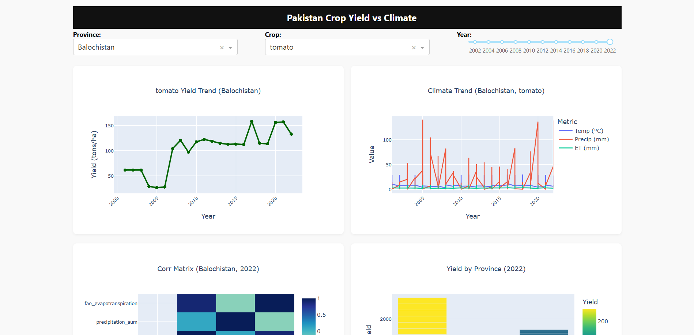
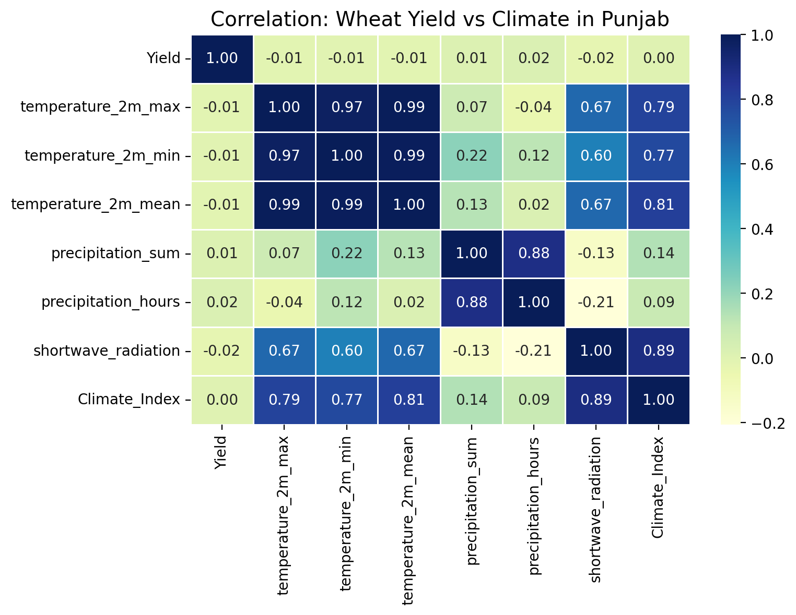
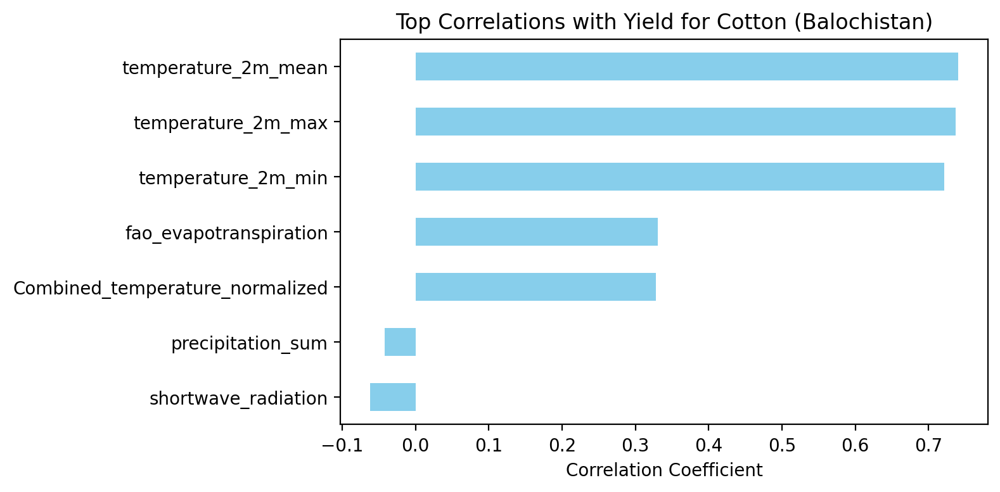
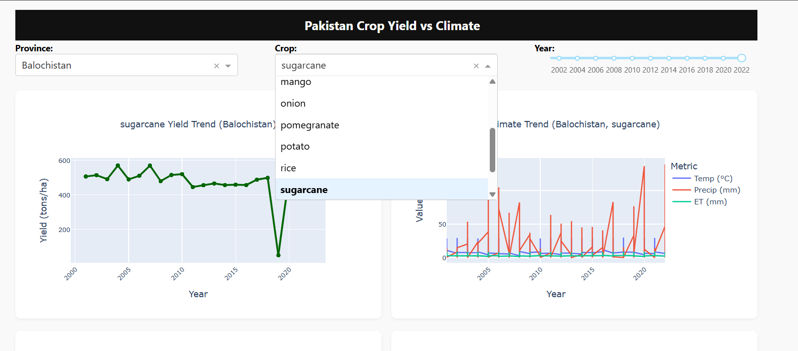

# 🌾 Pakistan Crop Yield vs Climate Change Dashboard

[](#)
[](#)

---

## 📌 Project Overview

This project explores how climate change impacts crop yields across provinces in **Pakistan**, using multi-year climate and crop data. It builds an interactive **Dash/Plotly** web dashboard where users can explore trends, correlations, and visual summaries of climatic variables and agricultural outcomes.

> 🎯 Ideal for: Data scientists, agricultural researchers, policy makers, and climate analysts.

---
## 📍 Live Dashboard

🟢 Access the fully interactive dashboard here:  
👉 **[Pakistan Crop Yield vs Climate](https://pakistan-crop-yield-vs-climate.onrender.com)**

---

## 📌 Motivation

Climate change is profoundly impacting agricultural outputs globally and **Pakistan**, with its heavy reliance on agriculture, is especially vulnerable. As a **first real-world data science project**, the motivation was to understand how climatic variables like temperature, rainfall, and evapotranspiration correlate with the **yield of major crops across provinces**.

This project serves as an interactive, visual analytics tool for researchers, policymakers, and data scientists to **explore, analyze, and correlate agricultural productivity with climate trends**.

---

## 🔗 Data Source

📦 Downloaded from: [Zenodo - Climate & Agriculture in Pakistan](https://zenodo.org/records/15486470)

It contains:

* **Climate data**: Max/Min temperatures, precipitation, wind speed, evapotranspiration, and solar radiation.
* **Agricultural economy data**: Crop-wise area, production, and yield across four provinces of Pakistan.

---

## 📊 What This Dashboard Does

An interactive **Dash-based web app** built with Plotly that visualizes:

1. 📈 **Crop Yield Trends** over years per province
2. 🌦️ **Climate Metrics** (temperature, rain, evapotranspiration)
3. 🔥 **Correlation Heatmaps** between yield and climate per crop/province
4. 🧱 **Bar Charts** comparing provincial yields
5. 📉 **Scatter Plot**: Temperature vs Yield
6. 📦 **Box Plots** to analyze yield distribution

---

## 🧪 Key Analyses & Findings

### 🔍 Data Cleaning & Merging

* Combined multiple sheets from Excel into a structured long-format dataset.
* Normalized and cleaned numeric fields; handled non-numeric encodings and province name mismatches.

### 📈 Trend Analysis

* Wheat yields showed gradual improvement across all provinces.
* Cotton and Mango yields in Sindh fluctuated heavily post-2010 due to rainfall variability.

### 🌡️ Climate Impact on Yield

* **Negative Correlation** (Yield vs Temperature Mean):

  * 🔻 *Punjab (Wheat, Cotton)*: High temperature linked to yield drop
  * 🔻 *Sindh (Mango, Banana)*: Fruit crops sensitive to excessive heat
* **Positive Correlation** (Yield vs Precipitation):

  * 🌧️ *Balochistan (Tomato, Onion)*: Better rainfall improved yield
  * 🌱 *KPK (Wheat, Sugarcane)*: Benefited from moderate precipitation
* **Evapotranspiration (ET)** was often negatively correlated with yield during drought years

### 🤖 Model Insights (Scikit-learn)

A simple regression model trained on climate variables was able to predict yields with:

* **R² Score**: `0.947`
* **MAE**: `16.76 tons/ha`

✅ High accuracy validated that climate variables have strong predictive power over crop yield.

---

## 💡 Project Structure

```
pakistan-crop-yield-vs-climate/
├── climate_dashboard.py     # Dash dashboard app
├── pakistan-crop-yield-vs-climate.ipynb   # Jupyter analysis notebook
├── merged_agri_climate_data.csv   # Cleaned merged dataset
├── style.css               # Responsive custom dashboard styles
├── README.md               # Project documentation
```

---

## 🚀 Running the Dashboard Locally

1. Clone the repository
   ```bash
   git clone https://github.com/Abdullah-Masood-05/pakistan-crop-yield-vs-climate.git
   cd pakistan-crop-yield-vs-climate
   ```
2. Install dependencies

   ```bash
   pip install -r requirements.txt
   ```
3. Run the notebooks in the order provided to follow the full pipeline.

4. Start the Dash application
   ```bash
   python climate_dashboard.py
   ```
   
---

## 🌍 Features

* 📱 **Responsive Layout** (mobile/tablet support via custom `style.css`)
* 🧮 Filter by `Crop`, `Province`, and `Year`
* 🌡️ Visualizes temperature/yield trade-offs
* 🔗 Real-time correlation for last selected year

---

## ⚙️ Tech Stack

<a href="#"> 
  
  
  
  
  
  
  
  
  

</a>

---

## 🤝 Contribution

If you have ideas to improve this dashboard — submit a pull request or open an issue!
All contributions are welcome 💚

---

## 📬 Author

**Abdullah Masood**

<a href="https://www.linkedin.com/in/abdullah-masood-921458221/" target="_blank">
  
</a>
<a href="https://github.com/Abdullah-Masood-05" target="_blank">
  
</a>

---

## 📢 Acknowledgments

* Thanks to [Zenodo](https://zenodo.org) for making climate data publicly accessible.
* Gratitude the open-source Python community.

---

## 📷 Screenshots

### 🌾 Dashboard Overview


### 📊 Correlation Heatmap


### 🧱 Yield Comparison


### 🔎 Filter by Crop & Year

---
